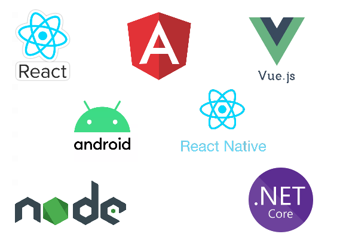
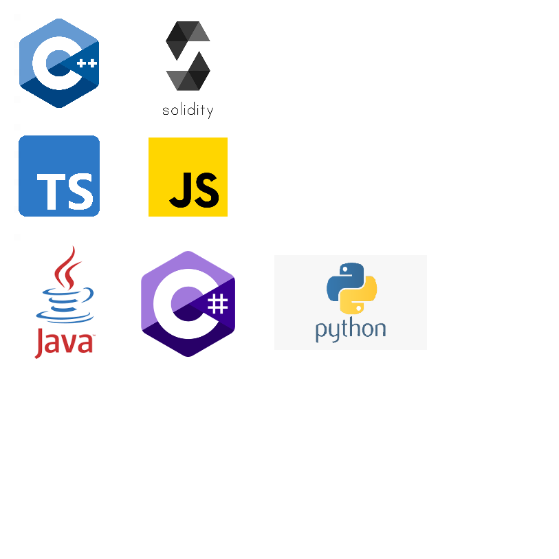
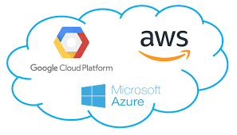

<h2> Hi there 👋, I'm Muhammad Usman </h2>

   

  ❖ Experience IT /Software Engineer/Automation Engineer/ Management professional with graduation in Information Technology.   ❖ A results-driven, customer-focused, articulate and analytical Senior Software Engineer who can think “out of the box”.  ❖ Strong in design and integration problem-solving skills. Expert in C#, .NET, and T-SQL with database analysis and design.  ❖ Skilled in developing business plans, requirements specifications, user documentation, and architectural systems research.  ❖ Strong written and verbal communications. Interested in a challenging technical track career in an application development environment. 

<h3> EXPERIENCED IN </h3>
⮚ Engineering web development, all layers, from database to services to user interfaces.  ⮚ Supporting legacy systems with backups of all cases to/from parallel systems  ⮚ Analysis and design of databases and user interfaces.  ⮚ Managing requirements & Implementing software development life cycle policies and procedures.  ⮚ Managing and supporting multiple projects, highly adaptable in quickly changing technical environments with very strong organizational and analytical skills. 

<h3> TECHNICAL SKILLS </h3>
<b>Languages -</b> C#, JavaScript, PHP 
<b>Front-End Development -</b> HTML5, CSS3 
<b>Frameworks - </b>ASP.NET Core, React Js, Node Js, Express.js 
<b>Blockchain - </b> Wax, Flow  
<b>Databases - </b>SQL Server, MongoDB, MySQL, SQL Lite, Postgresql  
<b>Version Control - </b> Git, TFVC  

 
<h3> Education and Qualification </h3>
❖ Bachelor of Computer Science (BSCS Hon’s) | July 2007 - september 2011| Kohat, Pakistan  

<h3>PROJECTS / ACCOMPLISHMENTS</h3>
<b>Lgnd.art | Blockchain</b> 

The LGND ecosystem enables dynamic interaction and trade between high end collectors and a curated roster of best-in-class artists. Our mission is to empower creators around the world to secure their legacy, reach a larger audience, and build their future through our eco-conscious block chain technology.
 
<a href="https://lgnd.art/">Lgnd.art</a>

 

<b>BoPayment | Fintech </b> 

Bo provides payment management solutions to businesses that are looking to diversify and create an identity. By utilizing a global network of payment providers, the Bo payment solution provides a more efficient payment process while saving valuable time, optimizing workflow and creating a competitive edge in the desired market.  
 
<a href="https://bopayments.com/">Admin-Panel</a>
<a href="https://control-center.io/">Control-Center</a>
<a href="https://card-console.com/">Car-Console</a>

 

<b>NOWwhere | Blockchain</b> 

    NOWstudios is the collaborative hub connecting Creators. We support Artists in the creation, promotion and marketing of future-ready NFTs.  
 
<a href="https://nowwhere.io/">NOWwhere</a> 

 

<b>POC(point of care), Deep Learn, Care Manager | Health Care</b> 

Healthcare, Accountable Care Organizations, MSO, ACO, Physician Practice, Independent Practice Association, EMR Agnostic Healthcare Technology, Value-Based Healthcare, and AI-Driven Solutions
 
<a href="https://wisemaninnovations.com/">Wisemaninnovations</a>

  

<b>Cigars Direct | Ecommerce </b> 

Cigars Direct is an E-commerce site as E-business covers online transactions, but also extends to all Internet based interactions with business partners, suppliers and customers such as: selling direct to consumers, manufacturers and suppliers; monitoring and exchanging information; auctioning surplus inventory; and collaborative product design. These online interactions are aimed at improving or transforming business processes and efficiency.
 
<a href="https://www.cigarsdirect.com/">Cigarsdirect</a> 
<a href="https://www.humidorsdirect.com/">Humidorsdirect</a> 

 
  
  

This is my CV which was last updated on `26-July-2022`.

<b>Blockchain</b>  
 

 

<b>Platforms and Framworks</b>  

 

 <b>Programing Languages</b>  
 

 

<b>CloudPlatforms</b>  
 

 

Feel free to reach out on the [Discord](https://discordapp.com/users/Usman0096#5430) directly. And if not available, email me I'll contact you asap.!
