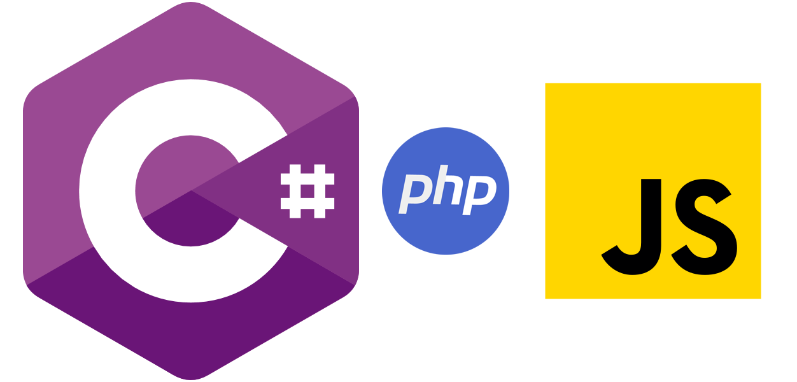

<h2> Hi there 👋, I'm Muhammad Usman </h2>
    

❖	Experience IT /Software Engineer/Automation Engineer/ Management professional with graduation in Information Technology.

❖	A results-driven, customer-focused, articulate and analytical Senior Software Engineer who can think “out of the box”.

❖	Strong in design and integration problem-solving skills. Expert in C#, .NET, and T-SQL with database analysis and design.

❖	Skilled in developing business plans, requirements specifications, user documentation, and architectural systems research.

❖	Strong written and verbal communications. Interested in a challenging technical track career in an application development environment.

Experienced in:
  ⮚	Engineering web development, all layers, from database to services to user interfaces.
  ⮚	Supporting legacy systems with backups of all cases to/from parallel systems
  ⮚	Analysis and design of databases and user interfaces.
  ⮚	Managing requirements & Implementing software development life cycle policies and procedures.
  ⮚	Managing and supporting multiple projects, highly adaptable in quickly changing technical environments with very strong organizational and analytical skills.

This is my CV which was last updated on `25-July-2022`.

### Blockchain
  
 
### Platforms and Framworks
  
 
### Programing Languages
  

Feel free to reach out on the [Discord](https://discordapp.com/users/Usman0096#5430) directly. And if not available, email me I'll contact you asap.!
